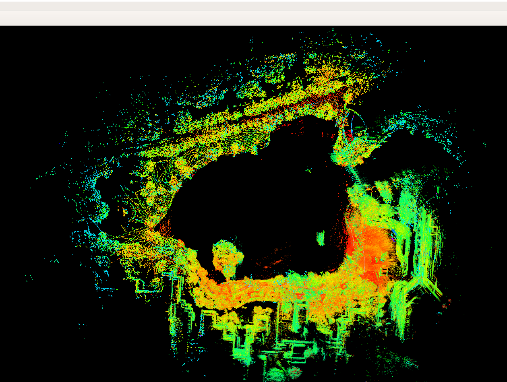

### 这是LVI-SAM学习小组为LVI-SAM代码录制的数据集使用教程
#### 1.设备

- 各个传感器坐标系已尽可能地保持主轴相互平行,避免复杂的参数标定过程。

#### 2.参数文件
- params_daheng.yaml是相机参数文件，包含lidar to camera的外参、相机内参标定数值、imu内参标定数值（实际至少是imu_utils标定结十倍，因为按照imu_utils标定的结果运行，很容易飘飞）等。
- params_vlp.yaml是激光雷达参数文件，包含imu to lidar的外参等。

#### 3.数据包
- 在两个场景下采集了数据包，一个是绕着思源湖走了一圈，一个是从学生服务中心出发，途经坡道和高架桥桥洞，两个数据包末尾均回到出发点。

#### 4.额外说明
- 此README刘嘉荣对源码lidar to camera坐标转换那部分的代码进行过修改，因为源码这块是默认常量，只能适配作者的数据集。
- 由于上述的修改，yaml文件对比原作的yaml文件后，能发现多出两行关于外参的参数。
  
#### 5.最终建图效果

